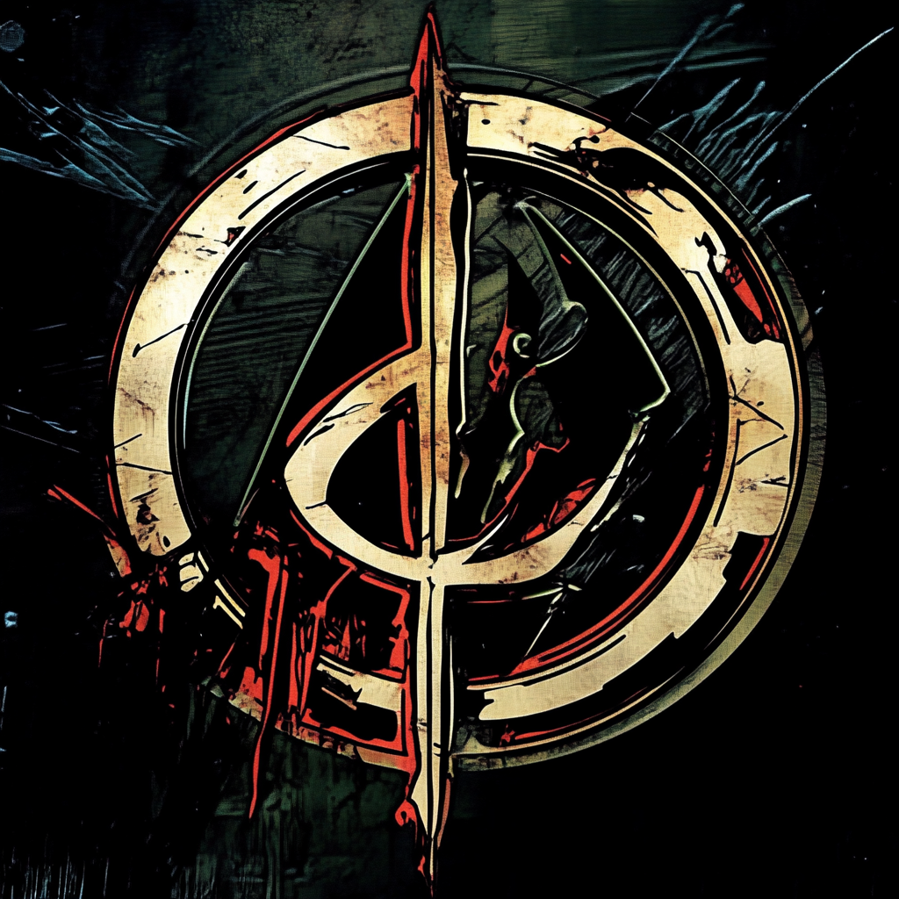

# NJK Music



## 📄 Project Description

Welcome to the **NJK Music** repository! This project powers [njkmusic.com](https://njkmusic.com), a hub for our label collective. The current catalog spotlights the **No Copyright Gaming Music** imprint, delivering free, high-quality tracks for gamers, streamers, and content creators.

NJK Music is a static website built with **Next.js**, **Tailwind CSS**, and **Shadcn** components, offering a seamless and visually appealing experience. The site integrates the **Spotify API** to feature a randomly selected track from our Spotify profile, ensuring that visitors always discover new music tailored for their gaming sessions.

## 🚀 Features

- **Static Website:** Fast and reliable performance with pre-rendered pages.
- **Music Label Presentation:** Showcases our label, mission, and available free tracks.
- **Free Tracks:** Access and download a curated selection of royalty-free music.
- **Spotify API Integration:** Automatically selects and displays a featured track randomly from our Spotify profile.
- **Responsive Design:** Optimized for all devices, ensuring a great user experience on mobile, tablet, and desktop.
- **Modern UI Components:** Utilizes **Shadcn** components for a clean and intuitive interface.
- **SEO Optimization:** Implemented best practices to enhance visibility on search engines.
- **Animations:** Smooth animations and transitions using **Framer Motion** for an engaging user experience.

## 🛠️ Technologies Used

- **[Next.js](https://nextjs.org/):** A React framework for building static and server-rendered applications.
- **[Tailwind CSS](https://tailwindcss.com/):** Utility-first CSS framework for rapid UI development.
- **[Shadcn Components](https://ui.shadcn.com/):** A collection of beautifully designed React components.
- **[Spotify API](https://developer.spotify.com/documentation/web-api/):** For fetching and displaying featured tracks.
- **[Framer Motion](https://www.framer.com/motion/):** For smooth animations and transitions.
- **[React Icons](https://react-icons.github.io/react-icons/):** Icon library for React applications.
- **[next-sitemap](https://github.com/iamvishnusankar/next-sitemap):** Generates sitemap for Next.js projects.

## 🗂️ Migrating Content From Strapi

The site now runs entirely on local markdown content. A helper script is included to export existing Strapi entries into the new `content/` directory structure:

```bash
NEXT_PUBLIC_API_URL="https://your-strapi-instance" \
NEXT_PUBLIC_STRAPI_API_TOKEN="your-token" \
npm run export:content
```

The script will:

- Download every post and music entry (including cover art) into `content/posts` and `content/music`
- Store associated images under `public/images/posts` and `public/images/music`
- Preserve metadata inside the markdown frontmatter so the app can render it without Strapi

> Tip: the generated `data/newsletter-subscribers.json` file is ignored by git to keep local signups private.

## 📥 Installation

### 1. Clone the Repository

```bash
git clone https://github.com/yourusername/ncgm.git
cd ncgm
